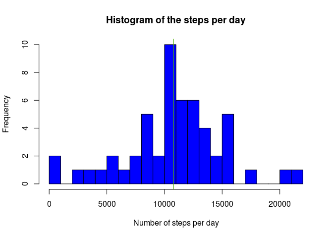
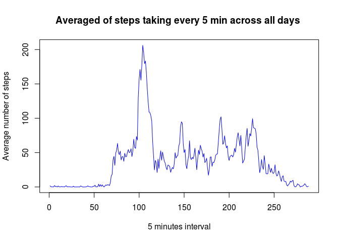
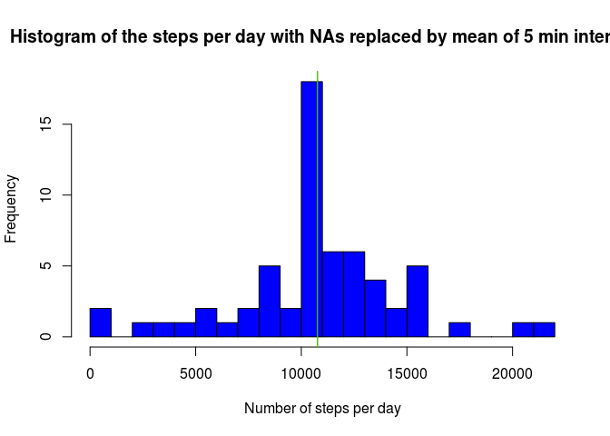
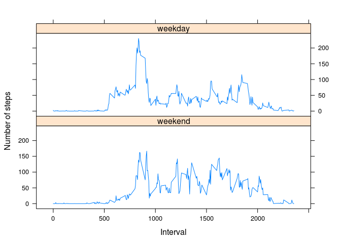

# Reproducible Research: Peer Assessment 1. Personal activity monitoring device data analysis.
##Introduction
Data from personal activity monitoring device was collected every 5 minutes through out the day. There is two months of data from an anonymous individual collected during two months in 2012,  October and November. In particular the number of steps taking by the individuals was recorded. Data analysis of it is reresented in this document.
##Synopsis
After loading the data and preproced it. The total of steps taken per day was calculated and presented in a histogram. Next the average daily daily activity pattern was analyzed and ploted. The data analysis was continue by inputing values to the NA values found. We add the mean of the 5 minutes interval to each missing value. Finally, the activity pattern between weekdays and weekend was analyzed and ploted.

## Data Processing


##Results
# What is mean total number of steps taken per day?

```r
steps_per_day <- unlist(lapply(days, function(x){ sum(x$steps)}))
mean_steps_per_day <- as.integer(mean(steps_per_day))
median_steps_per_day <- median(steps_per_day)
```

The mean and the median of the total number of steps taking per days are 10766 and 10765 respectivelly.


```r
hist(steps_per_day, breaks = length(days)/2, xlab= "Number of steps per day", col = "blue", main = "Histogram of the steps per day")
abline(v = mean_steps_per_day,  col="red")
abline(v = median_steps_per_day, col="green")
```

<!-- -->


## What is the average daily activity pattern?
1. Make a time series plot (i.e. type = "l" ) of the 5-minute interval (x-axis) and the average number of steps taken, averaged across all days (y-axis)

```r
min_5_interval <- split(act, act$interval)
aver_min_5_interval <- unlist(lapply(min_5_interval, function(x){ mean(x$steps)}))
```


```r
plot(names(aver_min_5_interval), aver_min_5_interval, xlab = "5 minutes interval", ylab="Average number of steps", type= "l",  col = "blue", main = "Averaged of steps taking every 5 min across all days ")
```

<!-- -->
2. Which 5-minute interval, on average accross all days in the dataset, contains the maximum number of steps?

```r
max_num_steps <- aver_min_5_interval[aver_min_5_interval==max(aver_min_5_interval)]
```
The `max_num_steps` 5-minutes interval contains the maximum number oof steps. 

## Imputing missing values
Calculate de total number of rows with NA


```r
act_tot<- read.csv("activity.csv")
#numb NAs are dim_tot minus dim activities where na.omit was used
numb_NAs = dim(act_tot)[1]-dim(act)[1]
```

The total number of rows with NAs are: 2304.

Filling the NAs steps with the mean of the 5 min interval and create a new database that have them replace.


```r
act_tot$steps <- as.numeric(unlist(apply(act_tot, MARGIN = 1, function(x){
    if(is.na(x[1])){
        int<-gsub("\\s", "", x[3])
        x[1] <- aver_min_5_interval[names(aver_min_5_interval)==int]
    }
return(x[1])
})))
```


```r
act_tot$date <- as.Date(act_tot$date)#, "%Y-%m-%d")

days_n <- split(act_tot, act_tot$date)

steps_per_day_n <- unlist(lapply(days_n, function(x){ sum(x$steps)}))

mean_steps_per_day_n <- as.integer(mean(steps_per_day_n))
median_steps_per_day_n <- as.integer(median(steps_per_day_n))
```

The mean and the median of the total number of steps per days in the database with the NAs replaced by the average of the correspondind 5 min intervals are 10766 and 10766 respectivelly.


```r
hist(steps_per_day_n, breaks = length(days_n)/2, xlab= "Number of steps per day", col = "blue", main = "Histogram of the steps per day with NAs replaced by mean of 5 min interval")
abline(v = mean_steps_per_day_n,  col="red")
abline(v = median_steps_per_day_n, col="green")
```

<!-- -->

By looking at the both histograms with and without NAs there is not a much difference with respect to the shape and also the mean and the median do not change to much.

## Are there differences in activity patterns between weekdays and weekends?


```r
Sys.setlocale("LC_TIME", "C")
```

```
## [1] "C"
```

```r
act_tot$date <- as.Date(act_tot$date)#, "%Y-%m-%d")
weekdays_n<- c('Monday', 'Tuesday', 'Wednesday', 'Thursday', 'Friday')
act_tot$week_days <- factor((weekdays(act_tot$date) %in% weekdays_n), 
         levels=c(FALSE, TRUE), labels=c('weekend', 'weekday'))
```


```r
steps_per_day_n <- aggregate(steps~interval + week_days, data=act_tot, mean)
print(steps_per_day_n[1:3,])
```

```
##   interval week_days      steps
## 1        0   weekend 0.21462264
## 2        5   weekend 0.04245283
## 3       10   weekend 0.01650943
```


```r
library(lattice)
xyplot(steps ~ interval | week_days, data=steps_per_day_n, type = "l", layout = c(1, 2), 
    xlab = "Interval", ylab = "Number of steps")
```

<!-- -->

##Conclusions
The data shows that is a tendency for the persons to walk more during the weekend as can be noticed from the contrasting plots between weekdays and weekend. However, statistical analysis have to be conducted to determined if these differences are significant.

Thank you for reading this document!
